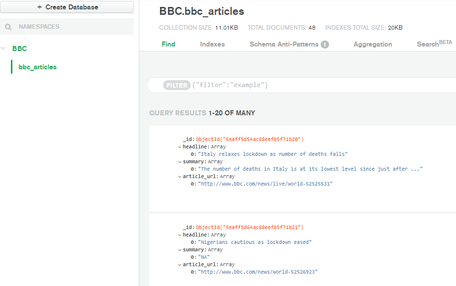
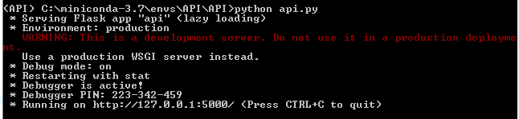
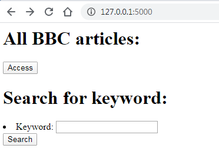

# News-Crawler-with-Scrapy  

This project use Python and Scrapy framework to crawl news article from bbc.com, and exctract relevant information to the news story, namely, headline, summary and article url. The scraped data is stored afterwards in MongoDB Atlas, moreover, a simple API is created using Flask framework to allow users access to the content in the Mongo database. 

### Prerequisites

This project needs the Scrapy library along with PyMongo to exctract data and store it  

```bash
pip install Scrapy
pip install pymongo
```  

Also, the Flask library along with Flask-PyMongo to whrite an API and access the Mongo database

```bash
pip install Flask
pip install Flask-PyMongo
```

### Usage

* Extracting data

Access the bbc news folder "..\bbc_news" and run the following command

```bash
scrapy crawl bbc_news
```

The created Spider bbc_articles.py will scrape the data and connect to the Mongo database through a pipeline in pipelines.py, the store the data. 



* Access to data

Access the API folder "..\API" and run the python script api.py

```bash
python api.py
```



This launches a builtin server, you can then open http://127.0.0.1:5000/ on you browser to work with the API



### Authors

* Mustapha EL MLILES (mustafa.elmliles@gmail.com)
